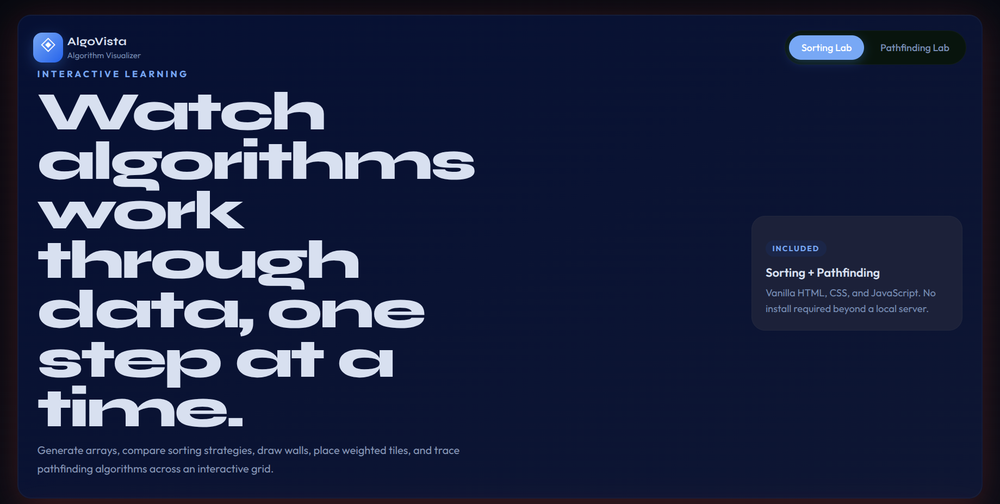

# AlgoVista



A polished web-based algorithm visualizer built with vanilla HTML, CSS, and JavaScript. AlgoVista showcases sorting and pathfinding algorithms with an elegant royal dark theme and interactive controls.

## Features

- Sorting visualizer
  - Bubble Sort
  - Selection Sort
  - Insertion Sort
  - Merge Sort
  - Quick Sort
- Pathfinding visualizer
  - Breadth-First Search
  - Dijkstra's Algorithm
  - A* Search
- Royal dark theme with navy, purple, gold, ruby, and emerald highlights
- Adjustable speed controls and array size
- Interactive grid with walls, weighted tiles, start node, target node, and eraser
- No frontend framework required
- No external dependencies required

## How to run

### Option 1: Run with Node

```bash
npm start
```

Then open:

```text
http://localhost:5173
```

### Option 2: Run with Python

```bash
python3 -m http.server 5173
```

Then open:

```text
http://localhost:5173
```

## Project structure

```text
algo-vista/
├── css/
│   └── style.css
├── js/
│   ├── main.js
│   ├── pathfinding.js
│   ├── sorting.js
│   └── utils.js
├── index.html
├── package.json
├── README.md
└── server.js
```

## Future improvements

- Add pseudocode panels with active-line highlighting during animation
- Add algorithm complexity and explanation cards
- Add maze generation algorithms
- Improve mobile-first controls and responsiveness
- Add sound effects or animation presets
- Add a light theme toggle
